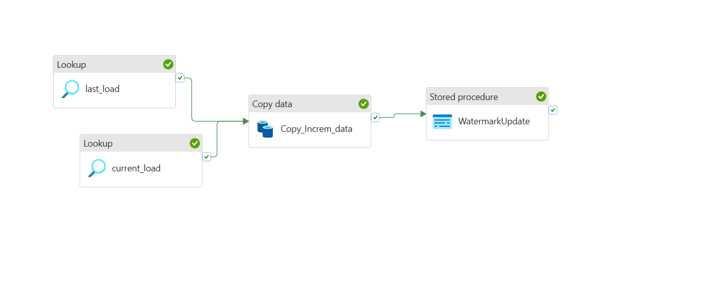
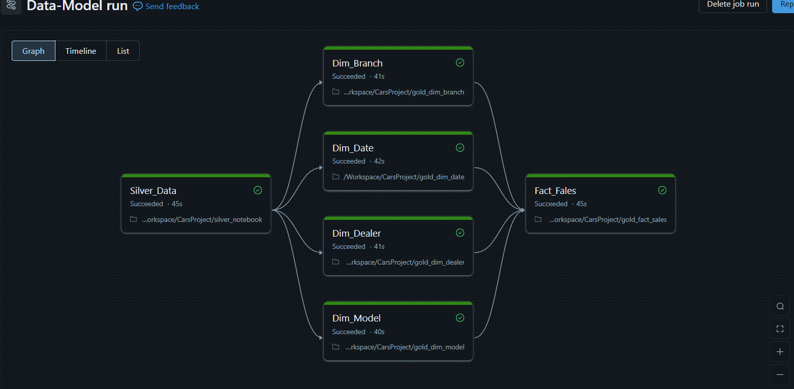

<div align="center">

# 🚗 Azure End-to-End Data Engineering Pipeline
### Cars Sales Data · Medallion Architecture · Delta Lake · Star Schema

[](https://azure.microsoft.com)
[](https://databricks.com)
[](https://delta.io)
[](https://powerbi.microsoft.com)

</div>

---

## 📐 Architecture

> End-to-end pipeline: SQL Source → ADF Ingestion → Bronze / Silver / Gold (ADLS Gen2) → Databricks Transformation → Synapse Star Schema → Power BI



The pipeline follows a **Medallion Architecture** pattern across three layers, all stored on **Azure Data Lake Storage Gen2**:

| Layer | Format | Pattern | Purpose |
|---|---|---|---|
| 🥉 Bronze | Parquet | Incremental load | Raw landing zone |
| 🥈 Silver | Parquet | One Big Table | Cleaned & unified |
| 🥇 Gold | Delta Lake | Star Schema | Analytics-ready |

---

## 🛠️ Tech Stack

| Concern | Service |
|---|---|
| Source | Azure SQL Database |
| Orchestration | Azure Data Factory (ADF) |
| Storage | Azure Data Lake Storage Gen2 |
| Transformation | Azure Databricks (PySpark) |
| Serving | Azure Synapse Analytics |
| Visualization | Microsoft Power BI |
| Security | Azure Active Directory + Key Vault |
| Version Control | GitHub |


---

## 🔄 Pipeline Walkthrough

### 1 · Ingestion — Azure Data Factory

ADF pulls data **incrementally** from the SQL source using a watermark-based approach, ensuring only new/changed records are loaded each run.



Key ADF components used:
- **Lookup activity** — reads the last watermark value
- **Copy activity** — moves incremental records to Bronze (ADLS Gen2)
- **Stored Procedure activity** — updates the watermark after successful load
- Pipelines linked to **GitHub** for version control

---

### 2 · Bronze Layer — Raw Data Store

Raw Parquet files land in the Bronze container partitioned by date. No transformations — pure source fidelity.

---

### 3 · Silver Layer — Databricks Transformation

Databricks PySpark notebooks read Bronze data and produce a clean **One Big Table (OBT)**:

- Schema enforcement and type casting
- Null handling and deduplication
- Merging incremental records with existing data
- Written back to Silver as Parquet



---

### 4 · Gold Layer — Delta Lake (Star Schema)

The Gold layer applies dimensional modelling, writing fact and dimension tables as **Delta Lake** tables. Delta gives ACID transactions, schema evolution, and time travel.

---

### 5 · Synapse Analytics — Star Schema

Azure Synapse reads the Gold Delta tables and exposes a queryable **Star Schema**.

#### Data Model

```
          dim_model                dim_dealer
        ┌──────────┐             ┌────────────┐
        │ Model_ID │             │ Dealer_ID  │
        │ model_   │             │ DealerName │
        │ category │             └─────┬──────┘
        └────┬─────┘                   │
             │                         │
             ▼                         ▼
dim_branch ──►      FactSales      ◄── dim_date
┌──────────┐   ┌────────────────┐   ┌──────────────┐
│Branch_ID │   │ dim_model_key  │   │ Date_ID      │
│BranchName│   │ dim_branch_key │   │ Day          │
└──────────┘   │ dim_date_key   │   │ Month        │
               │ dim_dealer_key │   │ Year         │
               ├────────────────┤   └──────────────┘
               │ Revenue        │
               │ Units_Sold     │
               │ RevPerUnit     │
               └────────────────┘
```

---

### 6 · Power BI — Reporting

Power BI connects to the Gold / Synapse layer and delivers interactive dashboards for revenue, units sold, and breakdowns by model, branch, and dealer.

---

## 🔐 Security

- **Azure Active Directory (AAD)** — identity and RBAC across all services
- **Azure Key Vault** — all secrets (storage keys, connection strings) are stored in Key Vault and referenced dynamically; no hardcoded credentials anywhere in notebooks or pipelines

---

## 📁 Repository Structure

```
Azure_DE_Cars_Data/
│
├── Dataset/
│   └── IncrementalSales.csv              # Source dataset
│
├── Databricks_CarsProject_notebook/
│   └── *.py / *.ipynb                    # PySpark transformation notebooks
│
├── Synapse/
│   └── *.sql                             # Star schema DDL + Synapse scripts
│
├── sql_db/
│   └── *.sql                             # Source SQL database scripts
│
└── ScreenShots/
    ├── azure_cars_de_pipeline_architecture.svg
    ├── azure_resources used.png
    ├── data_factory_pipeline.png
    └── Databricks_pipeline.png
```

---

## 🚀 Getting Started

```bash
# 1. Clone the repo
git clone https://github.com/kannusharma935/Azure_DE_Cars_Data.git

# 2. Provision Azure resources
#    - ADLS Gen2 (3 containers: bronze, silver, gold)
#    - Azure Data Factory
#    - Azure Databricks workspace
#    - Azure Synapse Analytics
#    - Azure Key Vault

# 3. Configure Key Vault with storage account keys + SQL connection strings

# 4. Import Databricks notebooks from Databricks_CarsProject_notebook/

# 5. Import ADF pipelines and link to your GitHub repo

# 6. Trigger the ADF pipeline — data flows Bronze → Silver → Gold automatically

# 7. Connect Power BI to Gold layer or Synapse endpoint
```

---

## 📖 Reference

- **Tutorial:** [Azure End-to-End Data Engineering Project — YouTube](https://www.youtube.com/watch?v=6_hXeNg9TJ0&t=204s)
- **Dataset:** [`Dataset/IncrementalSales.csv`](./Dataset/IncrementalSales.csv)

---

<div align="center">
Built with ❤️ on Microsoft Azure
</div>
